# Stoked Automations Architecture

**System architecture documentation with visual diagrams**

**Author:** Andrew Nixdorf <andrew@stokedautomation.com>
**Version:** 2025.0.0
**Last Updated:** October 2025

---

## Table of Contents

1. [System Overview](#system-overview)
2. [Repository Structure](#repository-structure)
3. [Mode System Architecture](#mode-system-architecture)
4. [Serena Integration Architecture](#serena-integration-architecture)
5. [MCP Server Architecture](#mcp-server-architecture)
6. [Workflow Automation Architecture](#workflow-automation-architecture)
7. [Marketplace Website Architecture](#marketplace-website-architecture)
8. [Data Flow Diagrams](#data-flow-diagrams)

---

## System Overview

```mermaid
graph TB
    User[👤 User] --> Claude[Claude Code CLI]

    Claude --> Modes[🎯 Development Modes]
    Claude --> Plugins[🔌 Plugin System]
    Claude --> MCP[🔧 MCP Servers]

    Modes --> Scripts[📜 Mode Scripts]
    Modes --> Config[⚙️ modes.json]

    Plugins --> Commands[📝 Commands]
    Plugins --> Skills[🎓 Skills]
    Plugins --> Agents[🤖 Agents]

    MCP --> Serena[💾 Serena Memory]
    MCP --> Kali[🔒 Kali Security]
    MCP --> Browser[🌐 Browser Testing]
    MCP --> Others[... 12 More MCPs]

    Scripts --> Workflows[⚡ Automated Workflows]
    Workflows --> Serena

    Serena --> Memory[(Memory Storage)]

    style User fill:#e97101
    style Claude fill:#f8f4ed
    style Modes fill:#d4c4a0
    style Serena fill:#2d1f0f,color:#f8f4ed
```



**Key Components:**
- **10 Development Modes** - Context-aware environments
- **231 Plugins** - Commands, Skills, Agents
- **15 MCP Servers** - Extended capabilities
- **Serena Integration** - Persistent memory layer
- **3 Automated Workflows** - Security, Testing, PR Review

---

## Repository Structure


---

## Mode System Architecture

### Mode Lifecycle

```mermaid
sequenceDiagram
    participant User
    participant ModeScript as Mode Script
    participant Serena as Serena MCP
    participant Config as modes.json
    participant Workflow as Workflows

    User->>ModeScript: ./enable-pr-review-mode.sh

    ModeScript->>Config: Load mode configuration
    Config-->>ModeScript: Token limits, plugins, agents

    ModeScript->>Serena: Load historical context
    Note over Serena: mode-context.sh pr-review
    Serena-->>ModeScript: Security findings (7d)<br/>Test failures<br/>Code patterns

    ModeScript->>Workflow: Run pre-checks
    Note over Workflow: Optional automated scans
    Workflow-->>ModeScript: Baseline established

    ModeScript->>User: ✓ PR Review Mode Active<br/>Context loaded<br/>Ready to review

    User->>ModeScript: [Works in mode]

    User->>ModeScript: [Exits mode]
    ModeScript->>Serena: Store session summary
    Note over Serena: create-memory.sh
```



### Mode Selection Logic


---

## Serena Integration Architecture

### Memory Flow

```mermaid
graph TD
    Events[Development Events] --> Capture{Event Type?}

    Capture -->|Security Scan| SecScript[security-scan-workflow.sh]
    Capture -->|Test Run| TestScript[test-workflow.sh]
    Capture -->|PR Review| PRScript[pr-review-workflow.sh]
    Capture -->|Manual| CreateMem[create-memory.sh]

    SecScript --> Serena[Serena MCP]
    TestScript --> Serena
    PRScript --> Serena
    CreateMem --> Serena

    Serena --> CreateMemTool[create_memory]
    CreateMemTool --> Embeddings[Generate Embeddings]
    Embeddings --> Storage[(Memory Storage)]

    Storage --> Index[Semantic Index]

    Future[Future Work] --> Search[search-context.sh]
    Search --> SearchTool[search_memories]
    SearchTool --> Index
    Index --> Results[Relevant Context]
    Results --> User[👤 User]

    style Serena fill:#2d1f0f,color:#f8f4ed
    style Storage fill:#e97101
```



### Context Loading Pipeline


---

## MCP Server Architecture

### MCP Communication Flow


### MCP Server Lifecycle


---

## Workflow Automation Architecture

### Security Scan Workflow

```mermaid
flowchart TD
    Start[Start Security Scan] --> LoadCtx[Load Historical Context]
    LoadCtx --> Serena1[search-context.sh<br/>"security vulnerabilities"]

    Serena1 --> Nmap[Run nmap Scan]
    Nmap --> Headers[Check Security Headers]
    Headers --> Static[Static Code Analysis]

    Static --> Secrets{Hardcoded<br/>Secrets?}
    Secrets -->|Yes| Store1[store-memory.sh<br/>CRITICAL]
    Secrets -->|No| SQL{SQL Injection<br/>Patterns?}

    SQL -->|Yes| Store2[store-memory.sh<br/>HIGH]
    SQL -->|No| Report[Generate Report]

    Store1 --> Report
    Store2 --> Report

    Report --> Serena2[Store Complete Scan]
    Serena2 --> End[Display Report]

    style Start fill:#e97101
    style Serena1 fill:#2d1f0f,color:#f8f4ed
    style Serena2 fill:#2d1f0f,color:#f8f4ed
    style Store1 fill:#d4c4a0
    style Store2 fill:#d4c4a0
```

### Test Workflow


---

## Marketplace Website Architecture

### Build & Deploy Pipeline


### Component Hierarchy


---

## Data Flow Diagrams

### Plugin Installation Flow

```mermaid
sequenceDiagram
    participant User
    participant CLI as Claude CLI
    participant Marketplace as Marketplace JSON
    participant GitHub
    participant Local as Local Files

    User->>CLI: /plugin install plugin-name@stoked-automations

    CLI->>Marketplace: Read marketplace.json
    Marketplace-->>CLI: Plugin metadata + source path

    CLI->>GitHub: Clone repository
    GitHub-->>CLI: Repository files

    CLI->>Local: Copy plugin files
    Note over Local: ~/.claude-plugins/plugin-name/

    CLI->>Local: Validate plugin.json
    CLI->>Local: Make scripts executable

    CLI->>User: ✓ Plugin installed successfully
```



### Mode Enhancement Flow


---

## System Integration Diagram

```mermaid
graph TB
    subgraph "User Layer"
        User[👤 Developer]
    end

    subgraph "Interface Layer"
        CLI[Claude Code CLI]
        Web[Marketplace Website]
    end

    subgraph "Mode System"
        Modes[Development Modes]
        Scripts[Mode Scripts]
        Config[modes.json]
    end

    subgraph "Plugin System"
        Commands[Commands]
        Skills[Skills]
        Agents[Agents]
    end

    subgraph "MCP Layer"
        Serena[Serena MCP]
        Kali[Kali MCP]
        Browser[Browser Testing]
        Others[12 Other MCPs]
    end

    subgraph "Automation Layer"
        SecWorkflow[Security Workflow]
        TestWorkflow[Test Workflow]
        PRWorkflow[PR Review Workflow]
    end

    subgraph "Data Layer"
        Memory[(Memory Storage)]
        Git[(Git Repository)]
        Files[(File System)]
    end

    User --> CLI
    User --> Web

    CLI --> Modes
    CLI --> Plugin System

    Modes --> Scripts
    Scripts --> Config
    Scripts --> MCP Layer
    Scripts --> Automation Layer

    MCP Layer --> Serena
    Serena --> Memory

    Automation Layer --> MCP Layer
    Automation Layer --> Git
    Automation Layer --> Files

    Plugin System --> CLI

    style User fill:#e97101
    style Serena fill:#2d1f0f,color:#f8f4ed
    style Memory fill:#e97101
```

---

## Deployment Architecture


---

## Future Architecture Enhancements


---

## Resources

- **Serena Integration:** `docs/SERENA_INTEGRATION_ARCHITECTURE.md`
- **Mode System:** `docs/MODE_SYSTEM_GUIDE.md`
- **Mode Enhancers:** `docs/MODE_ENHANCERS.md`
- **MCP Servers:** `docs/MCP_SERVER_GUIDE.md`
- **Plugin Standards:** `docs/PLUGIN_DEVELOPMENT_STANDARDS.md`
- **Workflow Automation:** `scripts/workflows/README.md`

---

**Last Updated:** October 2025
**Repository Version:** 2025.0.0
**Status:** Production-ready architecture